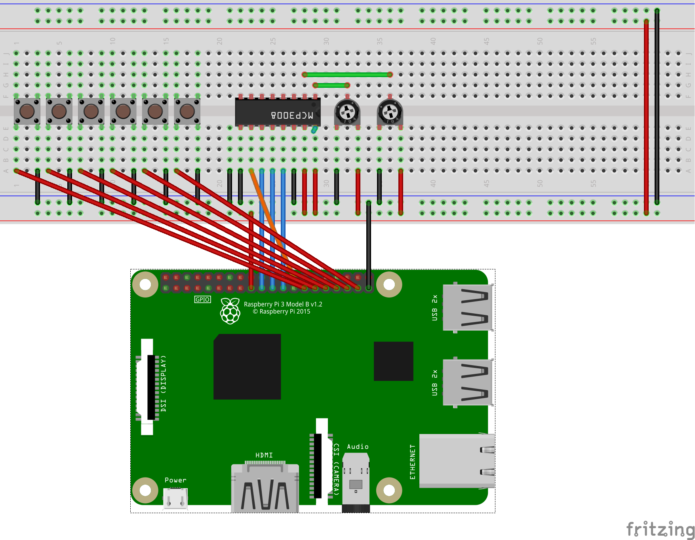

# Raspberry Pi / SenseHAT mp3 player

- Requires pygame, guizero, mutagen, gpiozero, sense_hat
- Store `mp3` files in the `Music` directory to have them loaded
- Use a SenseHAT with gpio extenders to allow access to gpiopins
- Wiring is shown below for the gpio controls.

